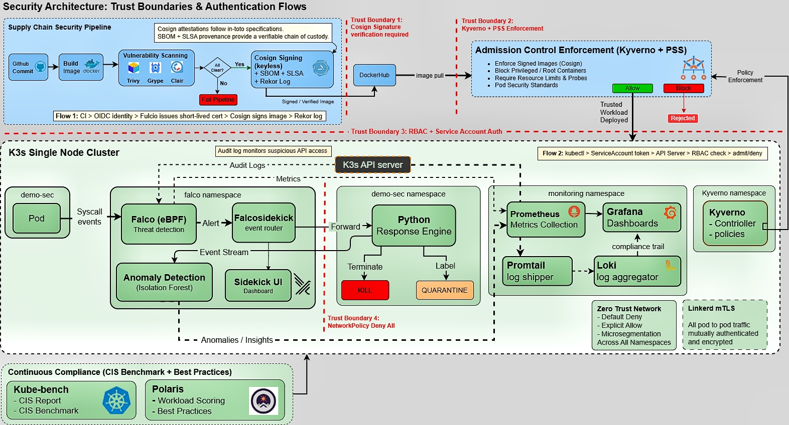

<div align="center">

# Advanced Container Security Platform

**Runtime Protection · Supply Chain Security · Kubernetes Threat Detection**

[](https://opensource.org/licenses/MIT)
[](https://k3s.io)
[](https://falco.org)
[](https://sigstore.dev)
[](https://cisecurity.org)

*EduQual Level 6 — Advanced Container Security Platform*

</div>

---

## Project Description

This platform implements defense-in-depth container security across the full software lifecycle — from the moment code is committed to the moment a workload runs in production. Every layer is built on open-source tooling, deployed on Kubernetes, and designed to reflect real-world security engineering decisions rather than checkbox compliance.

The core philosophy: trust nothing by default, verify everything at every stage, and respond automatically when something breaks through.

---

## Architecture



The platform is structured around four phases:

**Prevent** — Supply chain signing and admission control stop untrusted workloads before they ever run.

**Detect** — Falco's eBPF probe intercepts syscalls at the kernel level. Custom rules map detections to MITRE ATT&CK techniques. A separate ML service runs Isolation Forest anomaly detection on the event stream.

**Respond** — A Python response engine receives alerts from Falcosidekick and acts within milliseconds — terminating compromised pods or labeling them for quarantine depending on threat category.

**Observe** — Prometheus, Grafana, and Loki provide metrics, dashboards, and a searchable audit trail across every layer.

---

## Security Layers

### Supply Chain

Every image goes through a CI pipeline before it can run anywhere. Trivy scans for CVEs, Cosign signs the image against Sigstore's Rekor transparency log, and Syft generates an SBOM. An image that fails scanning never gets signed. An unsigned image never gets deployed — Kyverno blocks it at admission.

### Admission Control

Two enforcement layers sit in front of every workload:

**Pod Security Standards** — enforced at the namespace level. The `demo-sec` namespace runs under the `restricted` profile — no root processes, mandatory seccomp, no privilege escalation, explicit capability dropping required.

**Kyverno** — seven cluster-wide policies enforce image signature verification, resource limits, non-root execution, liveness/readiness probes, and hostPath restrictions. Policies that block deployment produce a clear, human-readable rejection message.

### Runtime Detection

Falco runs as a DaemonSet with a modern eBPF probe — no kernel module required. Eleven custom detection rules cover the threat categories most relevant to container escape and privilege escalation:

| Rule | Syscall | MITRE |
|------|---------|-------|
| Namespace Escape | setns() | T1611 |
| Namespace Manipulation | unshare() | T1611 |
| Filesystem Escape | mount() | T1611 |
| Container Breakout | pivot_root() | T1611 |
| Privilege Escalation | setuid/setgid | T1548 |
| Capability Escalation | capset() | T1548 |
| Shell Spawn | execve(sh/bash) | T1059 |
| Sensitive File Access | open/openat | T1552 |
| Privileged Pod Created | k8s audit | T1610 |
| kubectl exec | k8s audit | T1609 |
| RBAC Escalation | k8s audit | T1078 |

All rules are scoped to the `demo-sec` namespace to eliminate noise from system components. Startup syscalls from the container runtime (`runc`) are explicitly excluded to prevent false positives during pod initialization.

### Automated Response

Falco alerts flow through Falcosidekick to a Python response engine deployed in-cluster. The engine maps each rule to a response action:

| Threat Category | Action | Latency |
|-----------------|--------|---------|
| Syscall-level threats (breakout, shell, file access) | Force delete pod | < 300ms |
| Audit-level threats (privileged pod, kubectl exec, RBAC) | Label pod quarantine=true | < 300ms |

The response engine also forwards every event to the ML service for anomaly scoring before taking action.

> **Note on Falco Talon:** The original design used Falco Talon for automated response. During implementation, Talon 0.1.1 was found to be incompatible with standalone pods in PSS-restricted namespaces — it requires owner references that conflict with the restricted admission profile. The Python response engine was built as a direct replacement, providing identical response capability with deterministic, auditable behavior and full compatibility with the security constraints of the environment.

### ML Anomaly Detection

An Isolation Forest model runs per-container, building a behavioral baseline from incoming Falco events. Five features are extracted per event: alert priority, rule identity, hour of day, event burst rate, and unique rule count in the last 60 seconds. Once a container accumulates enough baseline events, the model begins scoring — negative scores flag statistical outliers.

This layer is designed to catch patterns that rule-based detection misses: low-and-slow attacks, novel syscall sequences, and behavioral drift over time.

### Compliance

**kube-bench** validates the control plane against the CIS Kubernetes Benchmark. **Polaris** scores every running workload against security best practices. Both feed into Grafana dashboards alongside the audit trail from Loki.

## Project Structure
```bash
.
├── app/                    # Hardened demo application
├── .github/workflows/      # CI/CD supply chain pipeline
├── falco/                  # Custom rules + Helm values
├── response-engine/        # Python automated response service
├── ml-service/             # Isolation Forest anomaly detection
├── monitoring/             # Prometheus · Grafana · Loki configs
├── kyverno/                # Admission control policies
├── compliance/             # kube-bench · Polaris
├── network-policies/       # Namespace isolation
├── k8s/                    # Audit policy · demo manifests
├── docs/                   # Architecture diagrams
└── scripts/                # Demo · verify · install
```
### Security Layers Mapping
- **Pre-deployment** → Kyverno, CI/CD scanning
- **Runtime** → Falco + Response Engine
- **Detection** → ML Service + Logs
- **Compliance** → kube-bench, Polaris
- **Observability** → Prometheus, Grafana, Loki
---

## Stack

| Layer | Tools |
|-------|-------|
| Runtime | k3s · containerd · Ubuntu 24.04 |
| Detection | Falco 0.43.1 · modern eBPF · custom rules |
| Response | Python · Flask · kubernetes-client |
| ML | scikit-learn · Isolation Forest · Gunicorn |
| Supply Chain | Cosign · Sigstore · Rekor · Syft · SLSA L2 |
| Admission | Kyverno · Pod Security Standards restricted |
| Compliance | kube-bench · Polaris · CIS Benchmark |
| Observability | Prometheus · Grafana · Loki · Promtail |
| Network | Kubernetes NetworkPolicy · default-deny |

---

## Access Points

| Service | Port | Credentials |
|---------|------|-------------|
| Grafana | :30300 | admin/admin |
| Falcosidekick UI | :30282 | admin/admin |
| Prometheus | :30900 | — |
| ML Anomalies | :31000 | — |
| Polaris | :30707 | — |
| Response Engine | :31001 | — |

---

**Ali Afnan** · EduQual Level 6 · Diploma in AI Operations

