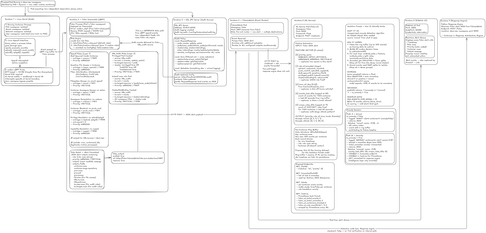

# Falco Runtime Detection

**Layer 3 of the Advanced Container Security Platform**  kernel-level, eBPF-based detection of anomalous container and cluster behavior, wired directly into the platform's automated response engine.


*End-to-end flow from kernel syscall to automated response action.*

---

## At a Glance

| | |
|---|---|
| **Engine** | Falco, modern eBPF driver (CO-RE, no kernel module) |
| **Ruleset** | 11 custom rules  8 syscall-level, 3 Kubernetes audit-level |
| **Base coverage** | Layered on top of Falco's shipped default rule set, not a replacement of it |
| **Scope** | `demo-sec` namespace (namespaced rules) + cluster-wide (non-namespaced resources) |
| **Alert fan-out** | Falcosidekick → Web UI + webhook → Flask response engine |
| **Response mapping** | `CRITICAL` → terminate · `WARNING` → quarantine |

---

## Detection Engine

Falco runs with the **modern eBPF driver** (`driver.kind: modern_ebpf`)  CO-RE (Compile Once – Run Everywhere) based, requiring no per-kernel-version kernel module build and no out-of-tree driver compilation. This is the same design decision recorded in [`../docs/design-decisions/03-runtime-detection-falco-ebpf.md`](../docs/design-decisions/03-runtime-detection-falco-ebpf.md): lower operational footprint than the legacy driver, and no kernel-version compatibility maintenance burden on the node.

A TTY is allocated for the Falco container (`tty: true`) to support interactive log tailing during investigation without needing a separate debug sidecar.

**Rule loading is additive, not a replacement.** `falco.rules_files` loads both `falco_rules.yaml` (Falco's shipped default library) and `custom-rules.yaml` (this repository's platform-specific rules), in that order. The custom rule set exists to target this platform's specific threat scenarios; it does not attempt to reproduce or replace the general-purpose coverage Falco already ships with.

---

## Rule Set

11 rules, split across two detection surfaces: syscall-level behavior inside running containers, and Kubernetes API audit events. Every rule is deliberately scoped to reduce noise  each syscall rule excludes the platform's own known-legitimate processes (`runc`, `containerd`, `k3s`, `falco`, `coredns`, `prometheus`, and `runc:`-prefixed shim processes) so that normal container lifecycle operations don't generate false alerts.

### Layer 1  Syscall Rules (8)

| Rule | Trigger | Priority | Response | MITRE ATT&CK |
|---|---|---|---|---|
| Shell Spawned Inside Container | `execve` of an interactive shell (`bash`, `sh`, `dash`, `zsh`, `ksh`, `fish`) not spawned by an expected parent | WARNING | Quarantine | T1059 – Command and Scripting Interpreter |
| Sensitive File Access in Container | `open`/`openat` on `/etc/shadow`, `/etc/passwd`, `/etc/sudoers`, `~/.ssh/*`, or the container runtime socket | WARNING | Quarantine | T1552 – Unsecured Credentials |
| Filesystem Escape via `mount` | `mount()` called from inside a container | CRITICAL | Terminate | T1611 – Escape to Host |
| Container Namespace Escape via `setns` | `setns()` called from inside a container | CRITICAL | Terminate | T1611 – Escape to Host |
| Namespace Manipulation via `unshare` | `unshare()` called from inside a container | CRITICAL | Terminate | T1611 – Escape to Host |
| Container Breakout via `pivot_root` | `pivot_root()` called from inside a container | CRITICAL | Terminate | T1611 – Escape to Host |
| Privilege Escalation via `setuid`/`setgid` | `setuid`/`setgid` to UID 0 from an unexpected process | WARNING | Quarantine | T1548 – Abuse Elevation Control Mechanism |
| Capability Escalation via `capset` | `capset()` called from inside a container | WARNING | Quarantine | T1548 – Abuse Elevation Control Mechanism |

### Layer 2  Kubernetes Audit Rules (3)

| Rule | Trigger | Priority | Response | MITRE ATT&CK |
|---|---|---|---|---|
| Privileged Pod Created | A pod create/update/patch request whose spec sets `privileged`, `hostPID`, or `hostNetwork` to `true` | CRITICAL | Terminate | T1610 – Deploy Container |
| `kubectl exec` into Pod | A `create` against `pods/exec` or `pods/attach` | WARNING | Quarantine | T1609 – Container Administration Command |
| ClusterRoleBinding Created | Any new `ClusterRoleBinding` object | CRITICAL | *See gap below* | T1078 – Valid Accounts |

**A defense-in-depth note on the Privileged Pod rule:** Kyverno's ClusterPolicies and Pod Security Standards (Layer 2 admission control) should already reject a privileged pod before it's ever scheduled. This rule exists as a **redundant, independent backstop**  if a namespace exception, policy gap, or admission-control failure ever let a privileged pod through, this rule catches it at runtime instead of relying on the admission layer never failing. This mirrors the platform's general defense-in-depth principle: no single layer is trusted to be infallible.

---

## Alert Pipeline
```text
Kernel syscall
│
▼
eBPF probe (modern_ebpf driver, in-kernel filtering)
│
▼
Falco rule engine (falco_rules.yaml + custom-rules.yaml)
│
├─▶ No match → discarded / low-verbosity log only
│
▼ Match
Falco alert generated
│
▼
HTTP output → Falcosidekick (falco-falcosidekick.falco.svc.cluster.local:2801)
│
├─▶ Web UI (falco-falcosidekick service, NodePort 30282)
│
▼
Webhook output → Flask response engine
(http://falco-response.demo-sec.svc.cluster.local:5000/falco)
│
▼
Response engine decision logic
│
├─▶ CRITICAL, high-confidence → terminate
├─▶ WARNING / lower-confidence → quarantine
└─▶ INFO / ambiguous → log only, human review
```

Falcosidekick sits between Falco and everything downstream as a fan-out layer  one alert becomes both a Web UI entry (for live human review) and a webhook call to the response engine (for automated action), rather than Falco talking to each consumer directly. This is a more precise picture of the alert path than a direct Falco→response-engine connection: Falcosidekick is the actual integration point, and it's what makes adding a second consumer (e.g. a future Alertmanager route, per [`../docs/production/monitoring-alerting.md`](../docs/production/monitoring-alerting.md)) a configuration change rather than a code change.

---

## Namespace Scope

All syscall rules and both namespaced audit rules are scoped to `k8s.ns.name = demo-sec`  the platform's target workload namespace. This is a deliberate noise-reduction choice: system namespaces (`kube-system`, `falco`, observability components) generate syscall and audit activity constantly as part of normal operation, and none of it is relevant to *this platform's* threat model. Scoping rules to the namespace actually under test keeps the signal-to-noise ratio high and keeps every fired alert meaningful.

The **ClusterRoleBinding Created** rule is the one exception, and necessarily so  `ClusterRoleBinding` is a cluster-scoped resource with no namespace of its own, so no `k8s.ns.name` filter applies. Any `ClusterRoleBinding` creation anywhere on the cluster fires this rule, on the basis that RBAC escalation at the cluster level is significant regardless of which namespace triggered it.

---

## Configuration Reference

`falco-values.yaml` in this directory drives the full deployment:

| Setting | Value | Purpose |
|---|---|---|
| `driver.kind` | `modern_ebpf` | CO-RE eBPF driver, no kernel module |
| `falco.rules_files` | default + `custom-rules.yaml` | Loads this platform's rules alongside Falco's shipped rules |
| `falco.http_output` | enabled → Falcosidekick `:2801` | Ships every alert to Falcosidekick for fan-out |
| `falcosidekick.webui` | enabled, NodePort `30282` | Live alert dashboard |
| `falcosidekick.config.webhook.address` | `falco-response.demo-sec.svc.cluster.local:5000/falco` | Delivers alerts to the Flask response engine |
| `mounts` | ConfigMap `falco-custom-rules` → `/etc/falco/custom-rules.yaml` | Injects the custom rule file into the Falco pod |
| `resources.requests` | 512Mi / 100m | Baseline reservation on the single-node cluster |
| `resources.limits` | 1024Mi / 500m | Ceiling to keep Falco from starving other platform components |

---

## Deployment

**Prerequisites:** a running K3s cluster with the `falco` and `demo-sec` namespaces created, and the Falcosecurity Helm repo added (`helm repo add falcosecurity https://falcosecurity.github.io/charts && helm repo update`).

```bash
# 1. Load the custom rule set into a ConfigMap
kubectl create configmap falco-custom-rules \
  --from-file=custom-rules.yaml=falco/custom-rules.yaml \
  -n falco

# 2. Deploy Falco + Falcosidekick via Helm
helm install falco falcosecurity/falco \
  --namespace falco -f falco/falco-values.yaml
```

**Verifying rules loaded correctly:**

```bash
kubectl logs -n falco -l app.kubernetes.io/name=falco | grep -i "custom-rules.yaml"
```

**Smoke-testing the pipeline end to end**  trigger two rules with one action:

```bash
kubectl exec -n demo-sec <pod-name> -- /bin/sh
```

This single command should fire **both** layers: the Kubernetes audit rule (`kubectl exec into Pod`, via the API server) and, once the shell process actually spawns inside the container, the syscall rule (`Shell Spawned Inside Container`, via eBPF). Seeing both alerts land in the Falcosidekick Web UI confirms the full path  kernel to audit log to Falcosidekick  is wired correctly.

---

## Known Gaps & Hardening Notes

Consistent with this platform's practice of stating gaps plainly rather than leaving them implicit (see [`../docs/limitations/known-limitations.md`](../docs/limitations/known-limitations.md)):

- **The response mapping is underspecified for cluster-scoped audit events.** `CRITICAL` → terminate is a clear, correct action against a *pod*. `ClusterRoleBinding Created` has no pod to terminate  the event describes a cluster-level RBAC change, not workload behavior. The response engine currently has no defined action for this rule beyond logging; a real remediation (e.g. auto-revert via GitOps reconciliation, per [`../docs/future-work/gitops-integration.md`](../docs/future-work/gitops-integration.md)) is not yet implemented.
- **TLS verification is disabled on both hops**  `http_output.insecure: true` (Falco → Falcosidekick) and `webhook.checkcert: false` (Falcosidekick → response engine). Acceptable for in-cluster traffic on a single-node lab deployment; would need to be revisited before any multi-node or externally reachable deployment.
- **The Falcosidekick Web UI ships with hardcoded default credentials** (`admin:admin`) exposed via NodePort. This is a direct instance of the broader secrets-hygiene gap already tracked in [`../docs/production/secrets-management.md`](../docs/production/secrets-management.md).
- **Rule coverage is intentionally narrow, not exhaustive.** These 11 rules target specific, well-understood attack patterns. The next highest-priority rules not yet implemented  container escape via runtime socket access, service account token theft, kernel module loading, `ptrace` injection, and others  are catalogued with proposed severity and response mappings in [`../docs/future-work/falco-rules-expansion.md`](../docs/future-work/falco-rules-expansion.md).
- **"Quarantine" as a response action needs a real enforcement mechanism** beyond a label change to be a genuine containment boundary. The full target design  NetworkPolicy isolation, Service endpoint removal, and a forensic hold period  is specified in [`../docs/future-work/pod-quarantine-implementation.md`](../docs/future-work/pod-quarantine-implementation.md).

---

## Related Documentation

- [`../docs/architecture/runtime.md`](../docs/architecture/runtime.md)  platform-wide runtime detection behavior and event pipeline
- [`../docs/architecture/threat-model.md`](../docs/architecture/threat-model.md)  what Layer 3 defends against, and its known limits
- [`../docs/design-decisions/03-runtime-detection-falco-ebpf.md`](../docs/design-decisions/03-runtime-detection-falco-ebpf.md)  why Falco and modern eBPF were chosen over the alternatives
- [`../docs/design-decisions/04-response-engine-custom-flask.md`](../docs/design-decisions/04-response-engine-custom-flask.md)  how the response engine consumes these alerts and decides on an action
- [`../docs/future-work/falco-rules-expansion.md`](../docs/future-work/falco-rules-expansion.md)  the next rules to add
- [`../docs/future-work/pod-quarantine-implementation.md`](../docs/future-work/pod-quarantine-implementation.md)  making "quarantine" a real enforcement boundary
