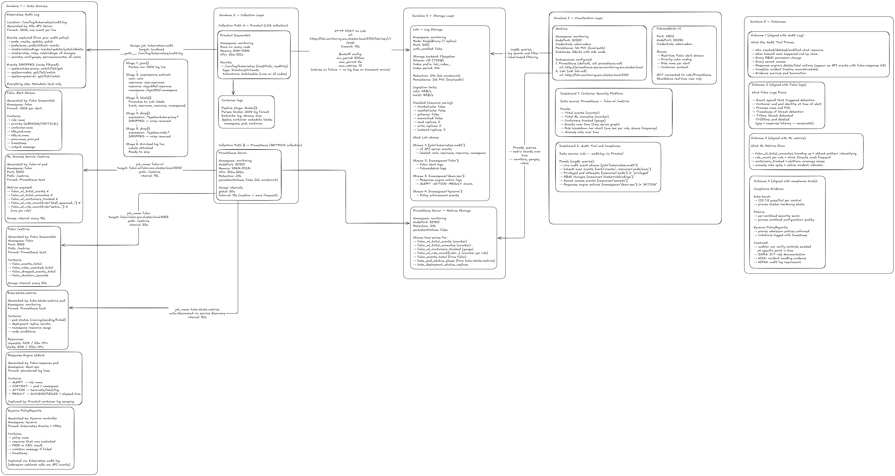

# Observability Stack

**The metrics-and-logs half of Layer 5**  Prometheus, Grafana, Loki, and Promtail, giving the platform a single pane of glass over what every other layer is doing. (kube-bench and Polaris, the compliance-scanning half of Layer 5, are separate tooling and are not covered by this directory  see [`../docs/design-decisions/06-observability-stack.md`](../docs/design-decisions/06-observability-stack.md) for how the two halves fit together.)


*Metrics and log flow across Prometheus, Loki, Promtail, and Grafana.*

---

## At a Glance

| | |
|---|---|
| **Metrics** | Prometheus  scrapes cluster + platform components, 24h retention, no persistent volume |
| **Logs** | Loki  SingleBinary mode, filesystem storage, 24h retention, **2Gi persistent volume** |
| **Log shipping** | Promtail  DaemonSet, ships container logs + the Kubernetes API audit log |
| **Dashboards** | Grafana  Prometheus + Loki as datasources, **1Gi persistent volume** |
| **Alerting** | **None configured**  Alertmanager is explicitly disabled |
| **Exposure** | Grafana `:30300`, Prometheus `:30900`, both NodePort, both plaintext, both default credentials or no auth |

---

## Components

### Prometheus

Deployed via the `prometheus-community/prometheus` chart. Two scrape jobs are defined beyond the chart's own defaults:

```yaml
extraScrapeConfigs: |
  - job_name: falco-ml
    static_configs:
      - targets: ['falco-ml.falco.svc.cluster.local:5000']
    metrics_path: /metrics
    scrape_interval: 15s
  - job_name: falco
    static_configs:
      - targets: ['falco.falco.svc.cluster.local:8765']
    metrics_path: /metrics
    scrape_interval: 30s
```

`falco-ml` is scraped every 15 seconds  tighter than every other interval in this stack (`scrape_interval: 30s` globally)  reflecting that anomaly-score data is the most time-sensitive metric this platform produces. `alertmanager`, `pushgateway`, and `nodeExporter` are all explicitly disabled; `kube-state-metrics` remains enabled (it has dedicated resource limits configured), providing Kubernetes object-state metrics (pod/deployment/node status) even with node-level hardware metrics turned off.

`server.persistentVolume.enabled: false`  Prometheus runs on ephemeral pod storage, with `retention: "24h"` as the only bound on data volume. This is the one component in this stack that genuinely matches the "no persistent volumes for observability data" gap described at the platform level  see the note under [Persistence: Correcting the Platform-Wide Claim](#persistence-correcting-the-platform-wide-claim) below, since Loki and Grafana do not share this gap.

### Loki

Deployed in **SingleBinary** mode (`deploymentMode: SingleBinary`, `replication_factor: 1`, `read`/`write`/`backend` all scaled to 0 replicas)  the monolithic single-process deployment appropriate for a single-node cluster, rather than Loki's distributed microservices mode. Storage is filesystem-backed (`storage.type: filesystem`), using the TSDB index format (`schema: v13`), with a **2Gi persistent volume** (`local-path` storage class) genuinely attached.

`retention_period: 24h` matches Prometheus's retention window, keeping both metrics and logs on the same data-lifetime budget. `ingestion_rate_mb: 4` / `ingestion_burst_size_mb: 8` are conservative limits appropriate to the single-node resource budget  worth keeping in mind during an actual incident, when Falco alert volume (and therefore log ingestion) is likely to spike exactly when this limit matters most (see [Known Gaps](#known-gaps--hardening-notes)).

`auth_enabled: false`  Loki's multi-tenancy auth layer is off, consistent with this being a single-tenant platform (`../docs/limitations/assumptions.md`). Caching (`chunksCache`, `resultsCache`), the gateway, memcached, self-monitoring, the Loki canary, and the ServiceMonitor are all explicitly disabled  every optional subsystem not strictly needed at this scale has been turned off to keep the footprint minimal.

### Promtail

Runs as a DaemonSet, shipping two distinct log sources to Loki at `http://loki.monitoring.svc.cluster.local:3100/loki/api/v1/push`:

1. **Container logs**, via the built-in `docker: {}` pipeline stage.
2. **The Kubernetes API audit log**, mounted from the host at `/var/log/kubernetes` (via `extraVolumes`/`extraVolumeMounts`, read-only) and scraped as a static file target:

```yaml
- job_name: kubernetes-audit
  static_configs:
    - targets: [localhost]
      labels:
        job: kubernetes-audit
        environment: lab
        __path__: /var/log/kubernetes/audit.log
  pipeline_stages:
    - json:
        expressions:
          verb: verb
          username: user.username
          resource: objectRef.resource
          namespace: objectRef.namespace
    - labels:
        verb:
        username:
        resource:
        namespace:
    - drop:
        expression: '.*system:kube-proxy.*'
    - drop:
        expression: '.*system:node.*'
```

Each audit event is parsed as JSON and re-labeled by `verb`, `username`, `resource`, and `namespace`  turning Loki's label-based indexing (chosen specifically for this reason, per `../docs/design-decisions/06-observability-stack.md`) into a genuinely queryable audit trail rather than an opaque log blob. The two `drop` stages filter out the highest-volume, lowest-value noise (`system:kube-proxy` and `system:node` service-account activity), keeping the audit stream focused on human and workload actions rather than routine control-plane chatter.

**This pipeline assumes the K3s API server is already configured to write an audit log to `/var/log/kubernetes/audit.log`.** K3s does not enable audit logging by default  it requires `--kube-apiserver-arg` flags (an audit policy file and log path) set at the K3s server level. That configuration lives outside this directory entirely; Promtail's job here only ships a file that's assumed to already exist.

### Grafana

Deployed with two provisioned datasources  Prometheus (`isDefault: true`) and Loki  both wired via internal cluster DNS, no manual datasource setup required after Helm install. Persistence is genuinely enabled (`1Gi`, `local-path`). Liveness/readiness probes are configured with a generous `initialDelaySeconds: 60` and `failureThreshold: 10`, accommodating slower pod startup on a resource-constrained single node rather than risking a healthy-but-slow-starting pod being killed prematurely.

`adminUser: admin` / `adminPassword: admin` are set directly in the values file  see [Known Gaps](#known-gaps--hardening-notes).

---

## Dashboards

Two dashboards are described as part of this stack:

**Container Security Platform**
- Total events, ML anomaly count, containers tracked
- Events over time, rule-frequency breakdown
- Sourced from Prometheus, scraping `falco-ml`'s `/metrics` endpoint

**Audit Trail and Compliance**
- Live Kubernetes audit event stream
- Filtered views by action type: exec, privileged, RBAC, secrets access
- Sourced from Loki, via the Promtail-shipped, JSON-parsed audit log

**Neither dashboard's JSON definition exists in this directory.** There is no `dashboards/` folder, no dashboard ConfigMap, and no `dashboards:` provisioning block in `grafana-values.yaml`. This means these two dashboards, as currently deployed, exist only inside Grafana's own database (backed by the 1Gi persistent volume)  built manually through the UI rather than defined as code. This is worth knowing precisely: a Grafana pod recreated against a *fresh* volume (not just restarted against the existing one) would come up with the Prometheus/Loki datasources correctly auto-provisioned, but with **neither dashboard present**, since nothing here recreates them declaratively.

---

## Persistence: Correcting the Platform-Wide Claim

Several documents elsewhere in this platform (`../docs/design-decisions/06-observability-stack.md`, `../docs/architecture/threat-model.md`, `../docs/limitations/known-limitations.md`) state that "neither Loki nor Prometheus has a persistent volume." Read against the actual values files in this directory, that claim is **only true for Prometheus**:

| Component | `persistence.enabled` | Size | Storage class |
|---|---|---|---|
| Prometheus | `false` |  |  |
| Loki | `true` | `2Gi` | `local-path` |
| Grafana | `true` | `1Gi` | `local-path` |

Loki and Grafana both survive a pod restart with their data intact; Prometheus does not. This is a meaningful, positive correction to the platform's documented gap inventory  the actual risk is narrower than previously stated, and specifically limited to metrics data, not logs or dashboards. The broader points those documents make still hold in a reduced form even for Loki: `local-path` is node-local storage, so a full **node** failure still takes Loki's and Grafana's data with it (per `../docs/design-decisions/07-single-node-k3s-tradeoffs.md`), and 24h retention still bounds how much history is kept even when the volume itself survives a pod restart.

---

## Deployment

**Order matters**  Prometheus and Loki should exist before Promtail has anywhere to ship logs to, and before Grafana's datasources have anything to point at:

```bash
helm install prometheus prometheus-community/prometheus \
  --namespace monitoring --create-namespace -f monitoring/prometheus-values.yaml

helm install loki grafana/loki \
  --namespace monitoring -f monitoring/loki-values.yaml

helm install promtail grafana/promtail \
  --namespace monitoring -f monitoring/promtail-values.yaml

helm install grafana grafana/grafana \
  --namespace monitoring -f monitoring/grafana-values.yaml
```

**Verifying scrape targets are healthy:**

```bash
kubectl port-forward -n monitoring svc/prometheus-server 9090:80
# then check http://localhost:9090/targets  falco-ml and falco should show State: UP
```

**Verifying the audit log is flowing:**

```bash
kubectl logs -n monitoring -l app.kubernetes.io/name=promtail | grep -i audit
```

If nothing appears here, the most likely cause is the K3s API server not yet being configured to write `/var/log/kubernetes/audit.log`  a prerequisite outside this directory, not a Promtail misconfiguration.

**Accessing the UIs:**
- Grafana: `http://<node-ip>:30300` (default credentials `admin`/`admin`)
- Prometheus: `http://<node-ip>:30900`

---

## Known Gaps & Hardening Notes

Consistent with this platform's practice of stating gaps plainly (see [`../docs/limitations/known-limitations.md`](../docs/limitations/known-limitations.md)):

- **No Alertmanager  confirmed at the config level.** `alertmanager.enabled: false` in `prometheus-values.yaml` is the concrete source of the gap already described in [`../docs/production/monitoring-alerting.md`](../docs/production/monitoring-alerting.md): metrics are collected and visualized, but nothing routes a critical signal to a human. Every dashboard here is "pull," never "push."
- **The Promtail container-log pipeline stage may not match the actual container runtime.** `pipelineStages: [docker: {}]` parses Docker's JSON-per-line log format. K3s's default container runtime is `containerd`, which emits logs in CRI log format, not Docker JSON  a different structure Promtail's `docker: {}` stage does not parse correctly. If this cluster is running the K3s default, container log parsing may silently fail to extract structured fields, degrading to raw unparsed lines. Promtail's `cri: {}` stage is the correct choice for a containerd-backed cluster; this should be verified against the actual container runtime in use, not assumed.
- **The Falco Prometheus scrape target's readiness is unverified against `falco/falco-values.yaml`.** The `falco` scrape job targets `falco.falco.svc.cluster.local:8765/metrics`. The Falco Helm values documented in `../falco/README.md` enable `http_output` (to Falcosidekick) but do not explicitly show `falco.metrics.enabled` or a webserver configuration confirming a `/metrics` endpoint is actually served on port 8765. This scrape job may be returning nothing (or 404s) depending on Falco's default webserver/metrics behavior  worth confirming directly (`kubectl exec` into the Falco pod and curl `localhost:8765/metrics`) rather than assuming the wiring is complete because the scrape config exists.
- **Grafana runs with hardcoded default credentials** (`admin`/`admin`), the same instance of the secrets-hygiene gap already tracked in [`../docs/production/secrets-management.md`](../docs/production/secrets-management.md).
- **No TLS anywhere in this stack.** Grafana and Prometheus are both exposed via plaintext NodePort; Loki's push API has no auth (`auth_enabled: false`) beyond network reachability. Acceptable for an isolated single-node lab deployment; not acceptable as-is if this cluster were ever reachable beyond a trusted local network.
- **Dashboards are not defined as code.** As noted above, both described dashboards live only in Grafana's own database. A `dashboards:` provisioning block (or exported dashboard JSON checked into this directory) would make them recreate automatically on a fresh Grafana deployment  currently, restoring them after a lost volume means rebuilding both by hand.
- **Loki's own health isn't monitored.** `selfMonitoring`, `lokiCanary`, and `serviceMonitor` are all disabled  Loki has no synthetic write-then-read check confirming ingestion is actually working end-to-end, beyond Promtail's own client-side retry/backoff logging.
- **Everything in this stack is a single replica.** Prometheus, Loki (`replicas: 1`), and Grafana all have exactly one instance each. A pod failure in any of them is a total, if temporary, loss of that function  the same single-point-of-failure story documented at the platform level in [`../docs/production/high-availability.md`](../docs/production/high-availability.md), reproduced concretely at the component level here.
- **Ingestion limits are tuned for steady-state, not incident bursts.** `ingestion_rate_mb: 4` / `ingestion_burst_size_mb: 8` in Loki are reasonable for normal operation but represent a real ceiling during an active incident, when Falco alert volume  and therefore the log traffic Promtail ships  is likely to spike well above baseline. A rate-limited drop during exactly the moment logs matter most is a risk worth being aware of, not just a tuning footnote.

---

## Related Documentation

- [`../docs/design-decisions/06-observability-stack.md`](../docs/design-decisions/06-observability-stack.md)  why Prometheus/Grafana/Loki were chosen over alternatives (Elasticsearch, a commercial SaaS)
- [`../docs/architecture/threat-model.md`](../docs/architecture/threat-model.md) and [`../docs/limitations/known-limitations.md`](../docs/limitations/known-limitations.md)  the platform-wide persistence gap this README refines at the component level
- [`../docs/production/monitoring-alerting.md`](../docs/production/monitoring-alerting.md)  what closing the missing-Alertmanager gap would require
- [`../docs/production/backup-recovery.md`](../docs/production/backup-recovery.md)  RTO/RPO implications, now more precise given Loki and Grafana's actual persistent volumes
- [`../falco/README.md`](../falco/README.md)  the `falco` and `falco-ml` scrape targets configured in `prometheus-values.yaml`
- [`../response-engine/README.md`](../response-engine/README.md)  the service this stack currently has **no** metrics scrape job for, since it exposes no `/metrics` endpoint (see that README's own Known Gaps section)
