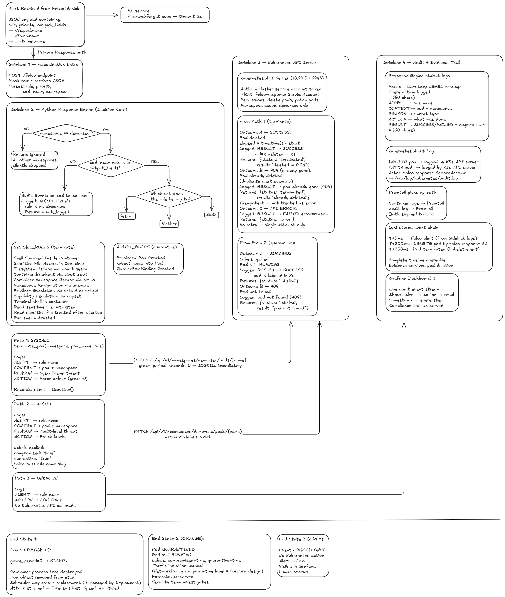

# Automated Response Engine

**Layer 4 of the Advanced Container Security Platform**  the service that turns a Falco alert into an action. Receives every Falco event over HTTP, decides what to do about it, and calls the Kubernetes API directly.


*Falco alert → response engine decision → Kubernetes API action.*

---

## At a Glance

| | |
|---|---|
| **Framework** | Flask, served by Gunicorn (`workers=1`, `threads=2`) |
| **Kubernetes client** | `kubernetes` Python client, in-cluster config |
| **Primary endpoint** | `POST /falco`  Falcosidekick webhook target |
| **Health/status** | `GET /health`, `GET /status` |
| **Actions taken** | Force pod deletion, or pod labeling  no third action exists in code |
| **Intelligence forwarding** | Every event, unconditionally, forwarded to the ML anomaly detection service |
| **Enforcement scope** | `demo-sec` namespace only |
| **Container** | `python:3.11-slim`, runs as non-root `appuser` |

---

## How a Decision Actually Gets Made

The dispatch logic in `app.py` is **rule-name based, not priority/severity based.** This is worth stating precisely, because it differs from how response tiering is described elsewhere in this platform's documentation (`../docs/design-decisions/04-response-engine-custom-flask.md`, `../falco/README.md`), which frames the response mapping as `CRITICAL → terminate`, `WARNING → quarantine`. The code that actually runs today does not branch on the `priority` field from the Falco event at all for its two active actions  it checks membership in one of two hardcoded Python sets:

```python
SYSCALL_RULES = { ... 12 rule names ... }   # → terminate_pod()
AUDIT_RULES   = { ... 3 rule names ... }    # → label_pod()
```

The real dividing line is **detection surface**  syscall-layer detections terminate; Kubernetes audit-layer detections label  not the rule's declared severity. Several rules in `SYSCALL_RULES` (e.g. `Shell Spawned Inside Container`, `Sensitive File Access in Container`, both declared `WARNING` in `falco/custom-rules.yaml`) are terminated exactly the same as `CRITICAL` rules like `Filesystem Escape via mount syscall`. The `priority` value is parsed from every event but is only ever used inside `log_only()`, for events that don't match either set. This is the platform's actual current implementation, and is tracked as a discrepancy to reconcile in [Known Gaps](#known-gaps--hardening-notes) below.

### `SYSCALL_RULES` → `terminate_pod()` (12 rules)

| Rule | Source |
|---|---|
| Shell Spawned Inside Container | `falco/custom-rules.yaml` |
| Sensitive File Access in Container | `falco/custom-rules.yaml` |
| Filesystem Escape via mount syscall | `falco/custom-rules.yaml` |
| Container Breakout via pivot_root | `falco/custom-rules.yaml` |
| Container Namespace Escape via setns | `falco/custom-rules.yaml` |
| Namespace Manipulation via unshare | `falco/custom-rules.yaml` |
| Privilege Escalation via setuid or setgid | `falco/custom-rules.yaml` |
| Capability Escalation via capset | `falco/custom-rules.yaml` |
| Terminal shell in container | Falco default rule library |
| Read sensitive file untrusted | Falco default rule library |
| Read sensitive file trusted after startup | Falco default rule library |
| Run shell untrusted | Falco default rule library |

The last four rows are a deliberate integration point worth calling out: the response engine doesn't only act on this platform's custom rules  it also terminates on four of Falco's own **shipped default rules**, extending automated response to Falco's stock detection coverage rather than only the platform-authored rule set documented in `falco/README.md`.

### `AUDIT_RULES` → `label_pod()` (3 rules)

| Rule | Source |
|---|---|
| Privileged Pod Created | `falco/custom-rules.yaml` (k8s audit) |
| kubectl exec into Pod | `falco/custom-rules.yaml` (k8s audit) |
| ClusterRoleBinding Created | `falco/custom-rules.yaml` (k8s audit) |

Everything not in either set  including any Falco default rule not explicitly listed above  falls through to `log_only()`: logged with full context, no Kubernetes action taken.

---

## Request Handling Pipeline
